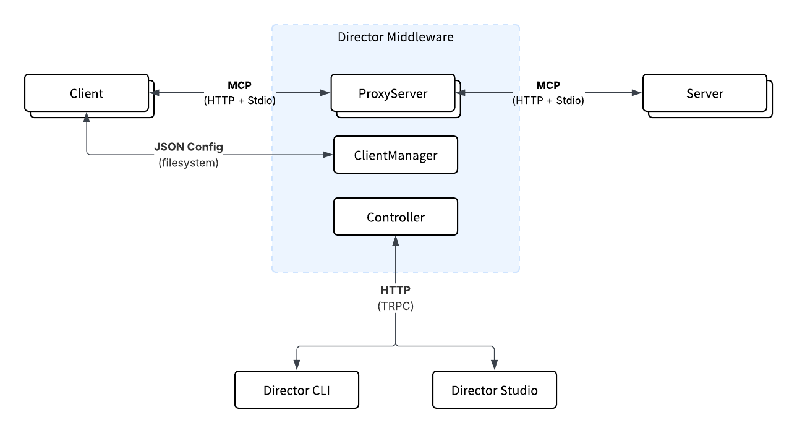

<Frame caption="Director architectural overview">
  
</Frame>

Director is MCP middleware that sits between MCP Clients and MCP Servers. For clients, it provides a single connection point (supporting HTTP Streamable, Stdio and SSE). For servers, it tools, prompts & resources (again supporting all MCP transports). 

By using Director, you can centralise MCP configuraton and abstract management away from your clients. To make this easy, we provide an CLI, GUI (Studio) and SDK that allow you to configure MCP easliy.

# Gateway

The core component of Director is the `Gateway`, that implements a proxy pattern to aggragate the MCP servers and serve them to the MCP clients through the standard protocol transports. In addition, Director also provides a `ClientCongigurator` module that makes it easy to connect clients such as Claude, Cursor and VSCode (with more on the way) to the `Gateway` without needing to write JSON manually. Finally, it provides a `Controller` layer which exposes an API (HTTP [TRPC](https://trpc.io/)) that allows you to add, remove and modify `ProxyServers`

# Gateway Management

The `Gateway` is a standalone piece of infrastructure that can either be run locally or on a remote server (right now, running it locally is what's best supported). Director implements a client / server architecture for management purposes (HTTP API, distinct from MCP client / servers). This is implemented in the `Controller` layer, and more specifically, this allows you to manage `ProxyServer` lifecycle, configure new targets (MCP Servers) and query the status / health of the service as well as the underlying servers and client connections. There are two main ways to interact with the `Gateway` currently:

- [CLI](../sdk/cli): The command line interface, which you can install through `npm`. It is also the primary way to run the gateway. 
- [Studio](../concepts/studio): The Studio is a web-based interface that allows you to manage the `Gateway` and its underlying `ProxyServers`. It's the best way for humans to interact with the `Gateway`, especially as the amount of servers grows.